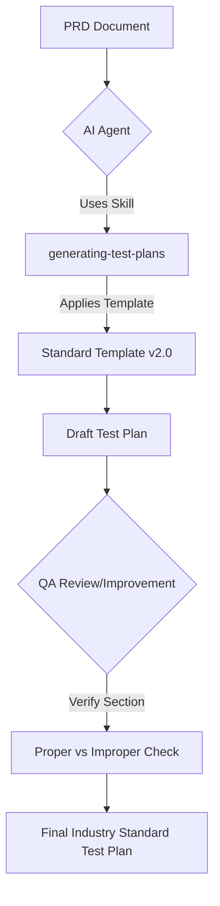

# AI-Powered Test Plan Generator

An automated system for generating, verifying, and improving industry-standard Test Plan documents using AI agents and specialized QA skills.

## 🚀 Overview

This repository contains a suite of professional Test Plans generated via the **Antigravity AI Coding Assistant**. It utilizes a specialized skill set designed to follow **IEEE 829** and **ISTQB** standards, ensuring that every document is comprehensive, detailed, and ready for enterprise-level QA cycles.

### Key Features
- **Standardized Templates:** All plans follow a rigorous 22-section template.
- **Context-Aware Generation:** Plans are tailored specifically to PRDs (Product Requirement Documents).
- **QA Industry Standards:** Inclusion of Entry/Exit criteria, Defect Management flows, and Non-functional requirements.
- **Multi-Domain Coverage:** Templates for Mobile Banking, E-commerce Checkout, Social Media, and Authentication modules.

## 🛠 Project Structure

```text
.
├── .agent/skills/generating-test-plans/   # The AI Skill logic and templates
├── mobile_banking_test_plan.md           # Example: End-to-end banking test plan
├── login_page_test_plan.md               # Example: Secure authentication test plan
├── facebook_app_test_plan.md             # Example: Global scale social media test plan
├── checkout_feature_test_plan.md         # Example: E-commerce transaction test plan
└── README.md                             # Project documentation
```

## 📊 Workflow Diagram



## 📋 Standard Test Plan Sections
1. Test Plan Identifier
2. Introduction
3. Test Items
4. Features to be Tested
5. Features Not to be Tested
6. Approach (Strategy)
7. Item Pass/Fail Criteria
8. Suspension/Resumption
9. Test Deliverables
10. Testing Tasks
11. Environmental Needs
12. Responsibilities
13. Staffing & Training
14. Schedule
15. Risks & Contingencies
16. Approvals
17. Entry Criteria
18. Exit Criteria
19. Test Data Strategy
20. Defect Management Process
21. Non-Functional Testing
22. Assumptions & Dependencies

## 🚦 How to Use
This project is powered by an AI skill. To use it:
1. Provide a PRD or a simple requirement description.
2. Ask the agent: *"Generate a test plan based on the standard template."*
3. The agent will output a professional `.md` file in the repository.

---
*Created with ❤️ by Santosh kumbar with help ofAntigravity AI*
